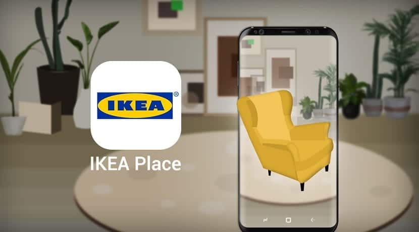

# PEC3_Manovich_Reloaded

**Autor**: Armando José Gutiérres Gutiérrez

**Asignatura**: Cultura Ditial

**Grado**: Multimedia

---

## Introducción

En la actualidad, hablar de software no es solo hablar de herramientas o tencologia. Es hablar de una forma de entender y transformar nuestro mundo. Lev Manovich, en su obra *El software toma el mando*, ya lo anticipaba: el software no solo media nuestras experiencias, sino que también **las moldea, las automatiza y las redefine**. Lo que antes era un proceso físico o humano, hoy puede estar guiado por algoritmos, cámaras, sensores, interfaces y realidades mezcladas que nos facilitan en muchos de los casos nuestras vidas.

En esta práctica, se propone **profundizar en el concepto de hibridación**, entendido como la fusión entre diferentes medios, disciplinas y tecnologías para crear nuevas formas de experiencia cultural y social. El objetivo es identificar dos ejemplos contemporáneos de hibridación que no aparecen en la obra de Manovich, pero que perfectamente podrían incluirse en una de sus obras.

Este ensayo está redactado con un enfoque narrativo y personal, siguiendo el estilo de cultura compartida que defiende la filosofía Creative Commons. Además, el documento ha sido publicado en un repositorio abierto de GitHub como parte de una metodología colaborativa, propia del crowdsourcing y del trabajo colectivo que ha impulsado la creación del software libre.

He seleccionado dos casos que considero especialmente significativos:

- **IKEA Place**, una app que convierte tu casa en un showroom digital gracias a la realidad aumentada.
- **Amazon Go**, un concepto revolucionario de tienda sin cajeros, impulsada por sensores, visión artificial y aprendizaje automático en el servicio.

Ambos casos permiten analizar cómo el software redefine la interacción entre lo físico y lo digital, y cómo la experiencia cotidiana se vuelve más fluida, automática e invisible de ver. Este trabajo no solo pretende describir estos ejemplos, sino también **reflexionar críticamente sobre su impacto**, sus implicaciones sociales y su relación con los principios del software definidos por Manovich.

---

## Caso 1: IKEA Place – Tu casa como probador virtual desde la APP

### ¿Qué es?

IKEA Place es una aplicación móvil de realidad aumentada que permite al usuario visualizar cómo quedarían distintos muebles en su casa, en tamaño real, utilizando simplemente la cámara del móvil. No es solo una herramienta de compra: es una experiencia de diseño interactivo, inmediata e inmersiva. Faclita el saberc como quedarian esos muebeles en
nuestra casa sin necesidad de trasladarlos y armarlos, con un clic sabremos si nos gusta o no.

### Hibridación presente

- Comercio minorista
- Realidad aumentada
- Diseño de interiores
- Procesamiento de imagen en tiempo real
- Interacción móvil con el espacio físico

### Análisis con Manovich

Con las lentes de Manovich, IKEA Place muestra:
- **Modularidad**: cada mueble es un módulo interactivo independiente y ajustable.
- **Automatización**: la app mide el espacio y ajusta los objetos sin intervención manual dejando todo al mando de la tecnologia.
- **Variabilidad**: la experiencia se adapta a cada casa y usuario dependiendo de la necesidad del mueble y ajustandose a su hogar.
- **Transcodificación**: el espacio físico de nuestra casa se transforma en entorno interactivo digital.

### Imagen ilustrativa  

### Video explicativo  
[🔗 Ver cómo funciona IKEA Place](https://www.youtube.com/watch?v=UudV1VdFtuQ&ab_channel=IKEA)

### Reflexión

Esta app me parece un ejemplo perfecto de cómo el software deja de ser un medio para convertirse en parte del entorno en el que vivimos. Ya no es mirar un catálogo; es sentir cómo encaja ese mueble en tu realidad. Además, empodera al usuario como diseñador de su propio espacio, de forma intuitiva y sin necesidad de conocimientos técnicos, simplemente usando la camara de su movil.

Pero hay algo más. IKEA Place también refleja el deseo de inmediatez y personalización que define la cultura digital contemporánea. El hecho de poder "probar" y "testar" muebles sin mover uno solo, desde el sofá, es una metáfora de lo que el software nos ofrece: un mundo que se adapta a nosotros, en lugar de que nosotros nos adaptemos a él.

En ese sentido, el acto de comprar deja de ser una transacción para convertirse en una experiencia inmersiva. Nos invita a jugar, explorar, experimentar. Y eso genera un tipo de compromiso emocional con el producto que va mucho más allá del consumo racional. Lo digital aquí no sustituye lo físico si no que lo enriquece, lo transforma.

Sin embargo, también podríamos cuestionar si esta hiperpersonalización no nos está aislando. ¿Y si nos acostumbramos tanto a experiencias digitales hechas “a medida” que luego lo real nos resulta incómodo o decepcionante por acostumbrarnos a la perfeccion (simulaciones)? Es una reflexión que, creo, no podemos dejar de lado.

---

## Caso 2: Amazon Go – El supermercado sin cajas y sin pausas

### ¿Qué es?

Amazon Go representa un cambio radical en la forma de comprar. Se trata de tiendas físicas sin cajas ni empleados para cobrar. Entras, coges lo que necesitas y te vas. La tecnología se encarga del resto: sensores, cámaras y software que detectan cada movimiento, producto y decisión del cliente lo cual es el futuro de las compras.

### Hibridación presente

- Comercio físico
- Visión artificial
- Inteligencia artificial
- IoT (Internet of Things)
- Aplicaciones móviles y automatización de pagos

### Análisis con Manovich

- **Automatización**: todo el proceso de pago y registro es invisible y automático.
- **Modularidad**: cada parte (sensores, cámaras, app) actúa de forma coordinada.
- **Variabilidad**: el sistema responde de forma personalizada.
- **Transcodificación**: el acto físico de comprar se convierte en datos procesados en la nube.

### Imagen ilustrativa  

### Video demostrativo  
[🔗 Ver Cómo funciona una tienda Amazon Go](https://www.youtube.com/watch?v=g_HpWmKqfWU&ab_channel=ElEconomista)

### Reflexión

Lo más sorprendente de Amazon Go es cómo hace desaparecer el proceso de compra. No es solo más rápido; es más fluido, casi mágico. Pero esa fluidez tiene un coste: renunciar a parte de nuestra privacidad. ¿Hasta qué punto estamos dispuestos a ser rastreados en cada paso, a cambio de comodidad? Es una pregunta que el software también nos obliga a hacernos casi en todas las aplicaciones de este tipo.

En un plano más filosófico, Amazon Go nos enfrenta a la idea de "lo invisible". Cuanto más eficiente es el software, menos lo notamos. Pero su presencia está ahí, registrándolo todo esa aparente desaparición es lo que lo hace tan fuerte: se convierte en una infraestructura silenciosa que modela comportamientos, hábitos y decisiones.

Este tipo de hibridación la tienda física que funciona como si fuera una interfaz digital abre posibilidades inmensas, pero también nos deja en una zona gris ética. ¿Qué pasa con los trabajadores que antes cobraban en caja? ¿Y con los datos que se recopilan de cada cliente? El software nos da eficiencia, pero también nos plantea dilemas que no son técnicos, sino humanos.

En resumen, Amazon Go no es solo innovación; es síntoma. Es un reflejo de hacia dónde vamos como sociedad: hacia experiencias cada vez más automáticas, más optimizadas... y, tal vez, más despersonalizadas y menos humanadas.

---

## Conclusión
Los dos casos analizados comparten un elemento clave: la fusión perfecta entre lo físico y lo digital, donde el software ya no se percibe como un añadido, sino como el motor mismo de la experiencia en la que nos inmersamos. IKEA Place transforma la compra en un juego de diseño doméstico, mientras que Amazon Go convierte el acto de consumir en algo tan natural que parece que la tecnología desaparece.

Esta es, quizá, la mayor aportación del software contemporáneo: hacerse invisible a la vez que reconfigura la realidad Y, como nos recuerda Manovich, esa transformación no es solo técnica, sino cultural y digital. Lo que está en juego no es solo cómo usamos las herramientas, sino cómo vivimos en un mundo definido por ellas.

Además, ambos casos muestran que el software no es neutral. Tiene ideología, tiene consecuencias, moldea formas de estar en el mundo. IKEA Place promueve una estética minimalista, ordenada, basada en la lógica del diseño escandinavo y la individualización. Amazon Go, por su parte, nos propone una sociedad sin fricciones... pero también sin rostros.

---

## Bibliografía y recursos

- Manovich, L. (2013). *El software toma el mando*.  
- IKEA (s.f.). *en.actualidadgadget.com*. Recuperado de: https://en.actualidadgadget.com/the-new-generation-of-the-ikea-place-app-is-now-available/
- Amazon (s.f.). *bench.epicnpoc.com*. Recuperado de: https://bench.epicnpoc.com/amazon-go/ 
- YouTube IKEA(2017). *Introducing Amazon Go*. https://www.youtube.com/watch?v=g_HpWmKqfWU&ab_channel=ElEconomista  
- YouTube ElEconomista(2018). *Saluda a IKEA Place*. https://www.youtube.com/watch?v=UudV1VdFtuQ&ab_channel=IKEA

### FIN
